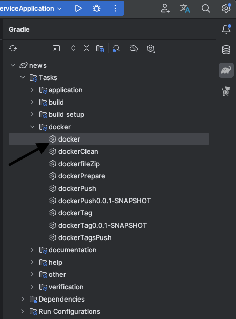
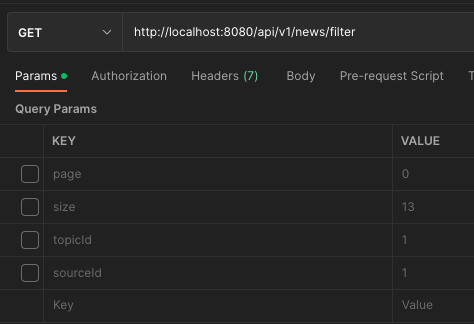

#### Spring-boot приложение для отображения новостных данных.

### WEB сервис

#### Необходимый софт

* `docker`
* `docker-compose`
* `Gradle`

Для запуска приложения необходимо

1. Выполнить build Docker Images в Gradle по пути `news/Tasks/docker/docker`

* 

2. Написан docker-compose

* для запуска необходимо пройти в директорию `news/config` и запустить командой `docker-compose up -d`

3. API для получения данных из БД:
    1. Обрабатываемые источники
    * GET путь: 'http://localhost:8080/api/v1/source'
   2. Тематики новостей
   * GET путь: http://localhost:8080/api/v1/topic
   3. Новости (всех, всех по источнику, всех по тематике) с функционалом пагинации
   * GET путь: http://localhost:8080/api/v1/news/filter
   * параметры для фильтрации новостей по источнику необходимо указать `KEY-sourceId, VALUE-"Id источника"`
   * параметры для фильтрации новостей по тематике необходимо указать `KEY-topicId, VALUE-"Id тематики"`
   * функционал пагинации параметры по умолчанию страница = 0, количество новостей на странице = 3 
   * для изменения параметров страницы необходимо указать `KEY-page, VALUE-"номер страницы"`
   * для изменения параметров количество новостей на странице необходимо указать `KEY-size, VALUE-"количество новостей"`
   * 
   
4. Безобасность через API токен клиента с правами на все методы API (без регистрации)

* Необходимо передать в Headers:
* Product-Token BW2oaAcpomJj0OBB0iHvZDBlvXMB3HhMJwid56popEkfvDIHhh

5. Реализована статистическую запускающуюся по `cron`-рассписанию.
6. Используя многопоточность, для каждого источника создаётся `csv` по пути `news/csv`.
* Формат `Тема,Количество новостей`. Файл называется названием источника.
7. Дополнительно сделан API для сохранения данных в БД
* POST путь: `http://localhost:8080/api/v1/load`

* ``` json
    "request": [
    {
    "source": "irbis.plus",
    "topic": "Помощь юр. лицам",
    "news": "Обновления законодательства в 2022 году"
    },
    ...
    ]
    ```